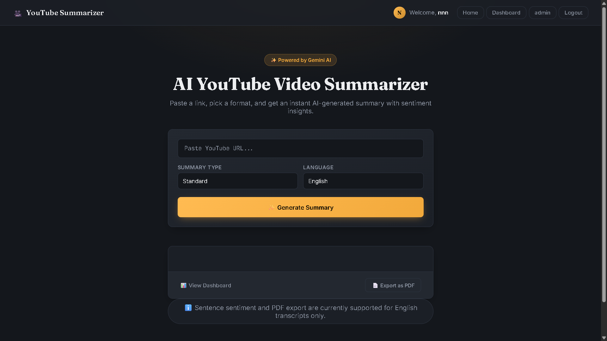
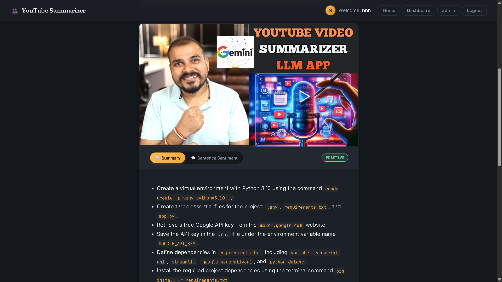
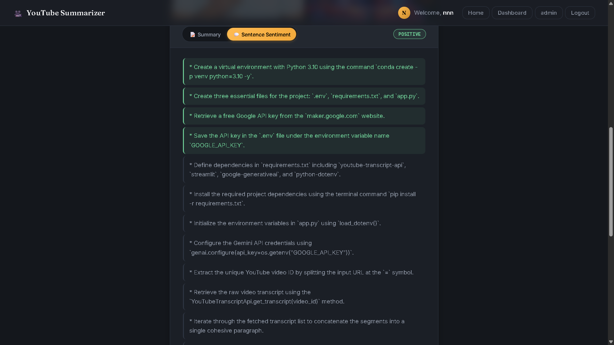
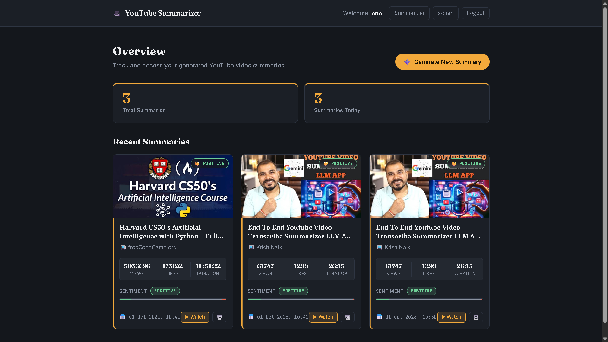

# 🎥 YouTube AI Summarizer

> **AI-powered YouTube video summarization using Django REST Framework and Generative AI.**

YouTube AI Summarizer is a web application that extracts transcripts from YouTube videos and uses Generative AI to generate concise, easy-to-read summaries.

The application supports **English and Hindi summaries**, user authentication, summary history, sentiment analysis, PDF export, YouTube video information, and a Django REST API.

---

## ✨ Features

- 🎥 **YouTube Transcript Extraction**
  - Extract transcripts directly from YouTube videos.
  - Supports videos with available captions/transcripts.

- 🤖 **AI-Powered Summarization**
  - Generate concise summaries from long YouTube transcripts.
  - Supports **Google Gemini** and **Groq**.

- 🌐 **Multi-Language Summaries**
  - Generate summaries in:
    - 🇬🇧 English
    - 🇮🇳 Hindi

- 📺 **YouTube Video Information**
  - Fetch video information using the YouTube Data API.

- 🧠 **Sentiment Analysis**
  - Analyze the sentiment of the generated content.
  - Provides sentiment-related output along with the summary.

- 👤 **User Authentication**
  - User registration
  - Login and logout
  - Authenticated user sessions

- 📊 **User Dashboard**
  - View previously generated summaries
  - Manage saved summaries
  - Access summary history

- 📝 **Summary History**
  - Save generated summaries
  - View previously saved summaries

- 🗑️ **Delete Summaries**
  - Delete summaries from history

- 📄 **PDF Export**
  - Export generated summaries as PDF documents

- 🔌 **REST API**
  - Backend APIs built using Django REST Framework

---

## 🧠 How It Works

```text
                    YouTube URL
                         │
                         ▼
                Extract Video ID
                         │
                         ▼
              Fetch YouTube Transcript
                         │
                         ▼
                  Text Processing
                         │
                         ▼
                Generative AI Model
                         │
                         ▼
                  Generate Summary
                         │
                  ┌──────┴──────┐
                  ▼             ▼
               Display         Save
               Summary        Summary
                  │             │
                  │             ▼
                  │        Summary History
                  │             │
                  └──────┬──────┘
                         ▼
                    PDF Export
```

---

## 🛠️ Tech Stack

| Category | Technologies |
|---|---|
| **Backend** | Python, Django |
| **API** | Django REST Framework |
| **AI / LLM** | Google Gemini, Groq |
| **NLP** | NLTK |
| **YouTube** | YouTube Transcript API, YouTube Data API |
| **Frontend** | HTML, CSS, JavaScript |
| **Database** | SQLite |
| **PDF Generation** | ReportLab |
| **Environment** | Python `venv`, `python-dotenv` |

---

## 📂 Project Structure

```text
youtube-summarizer/
│
├── youtubeMain/
│   │
│   ├── manage.py
│   │
│   ├── summerier/
│   │   ├── migrations/
│   │   ├── static/
│   │   ├── templates/
│   │   ├── admin.py
│   │   ├── forms.py
│   │   ├── models.py
│   │   ├── prompts.py
│   │   ├── serializers.py
│   │   ├── sentiment.py
│   │   ├── urls.py
│   │   ├── utils.py
│   │   ├── views.py
│   │   └── youtube_service.py
│   │
│   └── youtubeMain/
│       ├── settings.py
│       ├── urls.py
│       ├── asgi.py
│       └── wsgi.py
│
├── screenshots/
│   ├── Home.png
│   ├── output-text.png
│   ├── sentiment-output.png
│   └── dashboard.png
│
├── .env.example
├── .gitignore
├── requirements.txt
└── README.md
```

---

## ⚙️ Installation

### 1. Clone the Repository

```bash
git clone https://github.com/nirbhayyy/youtube-summarizer.git
```

```bash
cd youtube-summarizer
```

---

### 2. Create a Virtual Environment

```bash
python -m venv venv
```

#### Windows

```bash
venv\Scripts\activate
```

#### macOS / Linux

```bash
source venv/bin/activate
```

---

### 3. Install Dependencies

```bash
pip install -r requirements.txt
```

---

## 🔑 Environment Variables

Create a `.env` file in the project root.

You can use `.env.example` as a reference.

Example:

```env
API_KEY2=your-gemini-api-key
```

Add any other API keys required by your local configuration.

### ⚠️ Security

Never commit your `.env` file or API keys to GitHub.

Your `.gitignore` should contain:

```gitignore
.env
venv/
__pycache__/
*.pyc
db.sqlite3
```

---

## ▶️ Run the Application

Navigate to the Django project:

```bash
cd youtubeMain
```

Apply database migrations:

```bash
python manage.py migrate
```

Start the development server:

```bash
python manage.py runserver
```

Open the application:

**http://127.0.0.1:8000/**

---

## 📸 Screenshots

### 🏠 Home Page



---

### 📝 Generated Summary



---

### 🧠 Sentiment Analysis



---

### 📊 User Dashboard



---

## 🔌 REST API

The backend is built using **Django REST Framework**.

The application follows a request flow similar to:

```text
YouTube URL
     │
     ▼
API Request
     │
     ▼
Transcript Extraction
     │
     ▼
Text Processing
     │
     ▼
Generative AI
     │
     ▼
Generated Summary
     │
     ▼
API Response
```

The API layer is responsible for handling functionality such as:

- 🎥 Video summarization
- 📝 Transcript processing
- 📺 YouTube video information
- 👤 User authentication
- 📚 Summary history
- 🗑️ Summary deletion
- 📄 PDF generation

---

## 🎯 User Workflow

```text
1. User opens the application
             ↓
2. User enters a YouTube URL
             ↓
3. Application extracts the video ID
             ↓
4. YouTube transcript is retrieved
             ↓
5. Transcript is processed
             ↓
6. Generative AI generates the summary
             ↓
7. User selects English or Hindi
             ↓
8. Summary is displayed
             ↓
9. User can save the summary
             ↓
10. User can view it from the dashboard
             ↓
11. User can export the summary as PDF
```

---

## 🧩 Key Components

### `youtube_service.py`

Responsible for YouTube-related functionality:

- Extracting video information
- Working with YouTube APIs
- Retrieving video transcripts

### `prompts.py`

Contains prompts used to guide the Generative AI models during summarization.

### `sentiment.py`

Handles sentiment-related processing and analysis.

### `utils.py`

Contains reusable utility and helper functions used throughout the application.

### `models.py`

Defines Django database models used to store application data and summary history.

### `serializers.py`

Handles API serialization and validation using Django REST Framework.

### `views.py`

Contains Django views and API logic responsible for handling application requests.

---

## 🔐 Security

The application follows basic security practices:

- 🔑 API keys are stored using environment variables.
- 🚫 `.env` is excluded from Git.
- 👤 Django authentication is used for user accounts.
- 🔒 Sensitive credentials are not hard-coded into the source code.

For production deployment, additional security configuration should be applied.

---

## 🐛 Known Limitations

- YouTube videos must have an accessible transcript or caption track.
- Very long transcripts may require additional processing or chunking.
- AI-generated summaries may occasionally contain inaccurate information.
- AI and YouTube APIs are subject to their respective usage limits and availability.
- SQLite is currently used as the development database.

---

## 🚀 Future Improvements

- 🌍 Add support for more languages
- 🎬 Improve long-video summarization
- 📄 Add TXT and Markdown export
- 🤖 Add more AI model providers
- ⚡ Add background processing for long-running tasks
- 🧪 Improve automated unit and API testing
- 🗄️ Add PostgreSQL for production
- 📈 Improve dashboard analytics
- 🔐 Improve authentication and security
- ☁️ Deploy the application to a production cloud environment

---

## 📚 What I Learned

Through this project, I gained practical experience with:

- Python backend development
- Django
- Django REST Framework
- REST API development
- Generative AI integration
- Prompt engineering
- NLP and text processing
- YouTube API integration
- YouTube transcript extraction
- User authentication
- Database management
- PDF generation with ReportLab
- Environment variable management
- Building an end-to-end AI-powered web application

---

## 👨‍💻 Author

### Nirbhay Meher

**MCA | AI/ML Enthusiast | Python | Django | Machine Learning**

I enjoy building practical applications using **Artificial Intelligence, Machine Learning, NLP, and Python**.

---

## ⭐ Support

If you found this project useful or interesting, consider giving the repository a ⭐ on GitHub.

---

## 📄 License

This project is developed for educational and portfolio purposes.